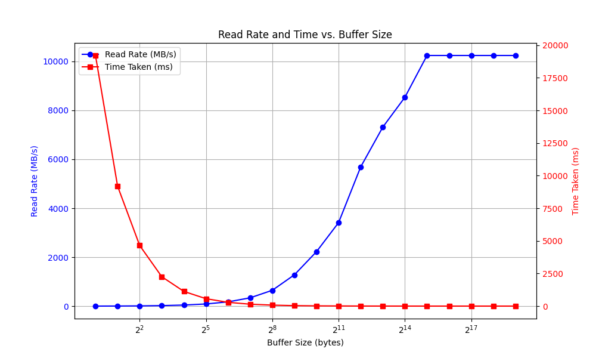
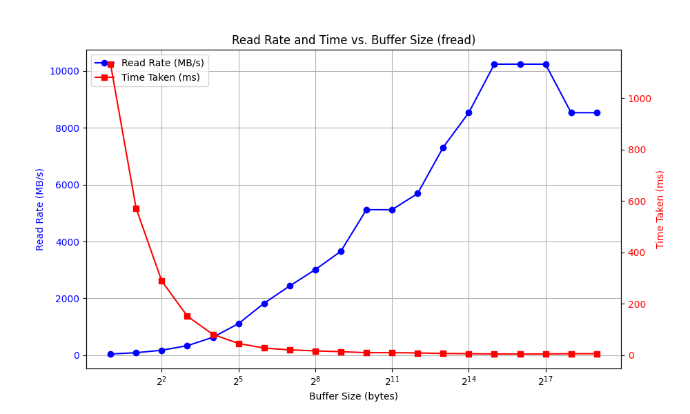
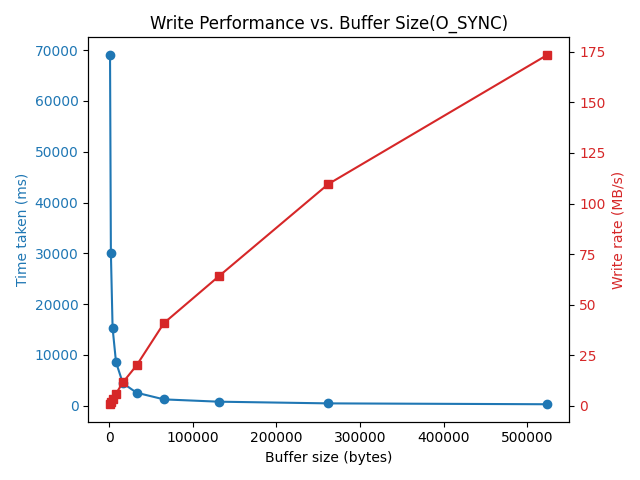
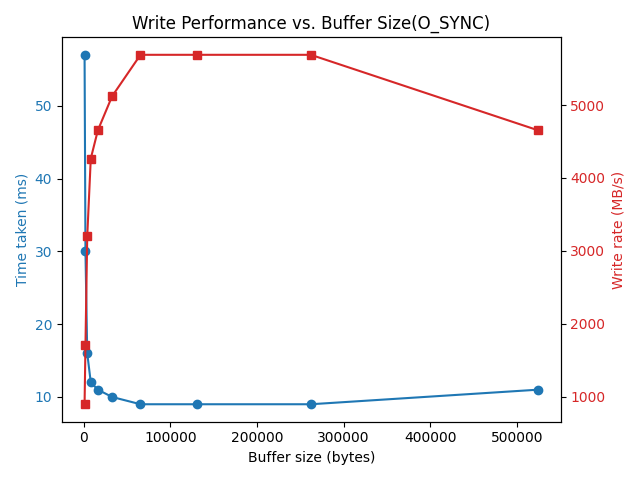

# 系统程序设计 Lab1
## 19307110250  郭仲天

---

### 1. 实验内容
- 测试Unix系统的read()函数的IO效率
- 测试Unix系统的fread()函数的IO效率
- 测试使用O_SYNC flag打开文件时Unix的write()函数的IO效率
- 测试不使用O_SYNC flag打开文件时Unix的write()函数的IO效率

---

### 2. 实验环境
- OS:Ubuntu 22.04.1 LTS
- CPU:Intel(R) Core(TM) i5-8265U CPU @ 1.60GHz
- RAM:16GB

---

### 3. 实验过程
> 本次实验中,read和fread函数采用了一个50M大小的基准测试文件,计划比较在不同buffersize下以字节为单位读取花费的时间以及读取的平均速率
#### 3.1 测试read()函数的IO效率

| BUFFERSIZE | 花费时间(ms) | 平均速率(MB/s) |
|:--------|:-------:|:-------:|
| 1 | 19207 | 2.67 |
| 2 | 9191 | 5.57 |
| 4 | 4647 | 11.02 |
| 8 | 2255 | 22.71 |
| 16 | 1129 | 45.35 |
| 32 | 572 | 89.51 |
| 64 | 293 | 174.74 |
| 128 | 150 | 341.33 |
| 256 | 79 | 648.10 |
| 512 | 40 | 1280.00 |
| 1024 | 23 | 2226.09 |
| 2048 | 15 | 3413.33 |
| 4096 | 9 | 5688.89 |
| 8192 | 7 | 7314.29 |
| 16384 | 6 | 8533.33 |
| 32768 | 5 | 10240.00 |
| 65536 | 5 | 10240.00 |
| 131072 | 5 | 10240.00 |
| 262144 | 5 | 10240.00 |
| 524288 | 5 | 10240.00 |

#### 3.2 测试fread()函数的IO效率
| BUFFER SIZE | 花费时间(ms) | 平均速率(MB/s) |
|:------------|:------------:|:--------------:|
| 1           | 1132         | 45.23          |
| 2           | 571          | 89.67          |
| 4           | 289          | 177.16         |
| 8           | 152          | 336.84         |
| 16          | 81           | 632.10         |
| 32          | 46           | 1113.04        |
| 64          | 28           | 1828.57        |
| 128         | 21           | 2438.10        |
| 256         | 17           | 3011.76        |
| 512         | 14           | 3657.14        |
| 1024        | 10           | 5120.00        |
| 2048        | 10           | 5120.00        |
| 4096        | 9            | 5688.89        |
| 8192        | 7            | 7314.29        |
| 16384       | 6            | 8533.33        |
| 32768       | 5            | 10240.00       |
| 65536       | 5            | 10240.00       |
| 131072      | 5            | 10240.00       |
| 262144      | 6            | 8533.33        |
| 524288      | 6            | 8533.33        |

> 本次实验中,write函数使用不同的flag写入50M的数据到output_file中,计划比较在不同buffersize下以不同flag打开文件时写入花费的时间以及写入的平均速率

#### 3.3 测试使用O_SYNC flag打开文件时Unix的write()函数的IO效率
| Buffer size (bytes) | Time taken (ms) | Write rate (MB/s) |
|:--------------------|:----------------:|:------------------:|
| 524288              | 295              | 173.56             |
| 262144              | 467              | 109.64             |
| 131072              | 800              | 64.00              |
| 65536               | 1252             | 40.89              |
| 32768               | 2568             | 19.94              |
| 16384               | 4436             | 11.54              |
| 8192                | 8569             | 5.98               |
| 4096                | 15291            | 3.35               |
| 2048                | 30147            | 1.70               |
| 1024                | 69087            | 0.74               |

#### 3.4 测试不使用O_SYNC flag打开文件时Unix的write()函数的IO效率
| Buffer size (bytes) | Time taken (ms) | Write rate (MB/s) |
|:--------------------|:----------------:|:------------------:|
| 524288              | 11               | 4654.55            |
| 262144              | 9                | 5688.89            |
| 131072              | 9                | 5688.89            |
| 65536               | 9                | 5688.89            |
| 32768               | 10               | 5120.00            |
| 16384               | 11               | 4654.55            |
| 8192                | 12               | 4266.67            |
| 4096                | 16               | 3200.00            |
| 2048                | 30               | 1706.67            |
| 1024                | 57               | 898.25             |
---

#### 4. 实验结果分析与总结
##### 4.1 数据展示的规律与特点
###### 4.1.1 read()函数
我们可以看出,随着buffersize的增大,在一定范围内,平均速率随着buffersize的增大而线性增大,但是当buffersize增大到一定程度时,平均速率的增加会趋于平缓,甚至不再增加.

###### 4.1.2 fread()函数
我们可以看出,随着buffersize的增大,在一定范围内,平均速率随着buffersize的增大而增大,但是当buffersize增大到一定程度时,会达到瓶颈,甚至可能会有波动.

###### 4.1.3 write()函数,使用O_SYNC flag

随着buffersize的增加,平均写入速率会线性增加,这里buffersize最大达到了524288,也就是512KB,目前还没有到达瓶颈,所以平均速率还在线性增加.

###### 4.1.4 write()函数,不使用O_SYNC flag

在buffersize比较小(小于20000B)时,一旦buffersize增大,平均速率会急剧增加,但是当buffersize增大到一定程度时(大于20000B),平均速率会趋于平缓,甚至不再增加.

##### 4.2 实验结果的分析与思考,以及原因
###### 4.2.1 read()函数和fread()函数的区别
- 我们可以看到,随着缓冲的增大,系统调用的次数减少,由于此时大部分时间都花费在系统调用上,所以平均速率都会随着buffersize的增大而线性增大.
- 当缓存增大到一定程度时,由于系统调用的次数已经很少,此时大部分时间花费在和磁盘的交互上,而磁盘的读取速率是有限的,所以平均速率会趋于平缓,甚至不再增加.
- 在本机上,磁盘的IO瓶颈在10000MB/s左右,所以不论是read()函数还是fread()函数,最终速率都会趋于10000MB/s.
- 由于read()函数是系统调用,而fread()函数是库函数,fread()存在c语言自行封装的缓存,所以fread()函数的速率在刚开始时会比read()函数的速率高,不需要更多的手动操作.
- read()函数更接近于系统调用,所以最后的速率会更加稳定,而fread()函数的速率会有一定的波动.

###### 4.2.2 write()函数的区别
- 当使用O_SYNC flag打开文件时,write()函数会在每次写入时都会进行同步,也就是说,每次写入都会等待磁盘的写入完成,所以速率会比较慢,此时主要的时间花费在等待磁盘写入以及系统调用上,所以随着buffersize的增大,系统调用次数的等待磁盘的次数减少,速率会线性增加.
- 当不使用O_SYNC flag打开文件时,write()函数会在写入时不会等待磁盘的写入完成,所以缓存的增大只是加快了和cache的交互,所以速率在刚开始会随着buffersize的增大而线性增加(写入速率在0-3200MB/S之间),但是当buffersize增大到一定程度时,由于cache的大小是有限的,所以cache满了以后同样要等待磁盘的写入,所以速率会趋于平缓,甚至不再增加,此时的瓶颈在于cache的大小和磁盘的写入速率.
- 我们可以看到,使用O_SYNC flag写入时,速率会比不使用O_SYNC flag慢的多,大概在几十到几百倍的差距,而这也说明了cache的速率很快,使用cache的重要性.
##### 4.3 提高IO效率的方法和建议
###### 4.4 读取
- 可以使用封装好的库函数,如fread()等函数,这些函数会自动进行缓存,不需要手动操作.
- 在内存容量足够的情况下,可以适当增大buffersize,这样可以减少系统调用IO的次数,提高效率.
###### 4.5 写入
- 可以使用尽量大的写入缓存,这样可以减少系统调用IO的次数,提高效率.
- 但是写入缓存并不是越大越好,因为cache的大小是有限的,当cache满了以后,还是要等待磁盘的写入,所以写入缓存的大小应该是一个平衡点,既要尽量大,又不能太大,避免写入缓存太大导致进程占用过多内存.
- 在绝大部分场景下,可以不使用O_SYNC flag,这样可以大大提高写入速率,但是在一些特殊场景下,如写入数据库,写入日志等场景下,需要保证数据的完整性,此时可以使用O_SYNC flag,但是速率会比较慢.

