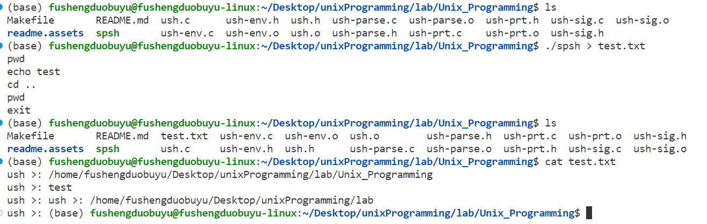
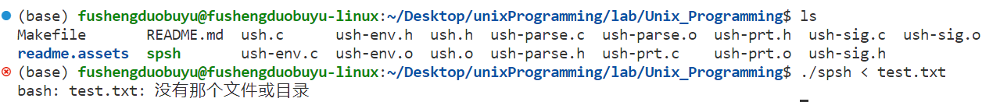
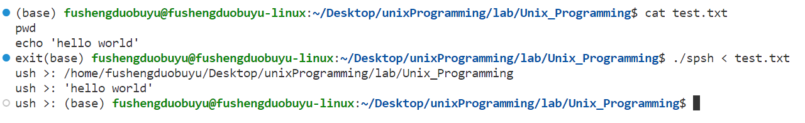
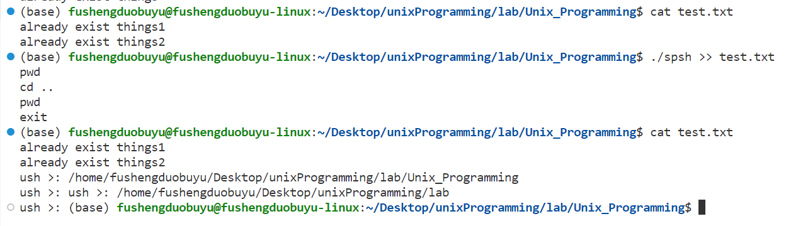

# 系统程序设计lab2
> 郭仲天 19307110250
## 实验介绍
参考提供的代码，为 UNIX 实现一个简单的用户 shell，提供命令执行、I/O 重定向、管道和环境处理功能。

## 实验要求
1. 支持基础指令或操作符（10分）：cd，echo，exit，pwd，这些指令应该作为shell的内部指令实现。
2. io重定向操作（10分）：>，<，>>，需要支持重定向到流和文件。
3. 处理环境变量（5分）：支持环境变量HOME和PATH，以及修改环境变量的操作符，包括=（环境变量赋值），set，unset，export。
4. 指令合法性检查（5分）：检查外部输入的指令是否合法。
管道操作符（10分）：支持｜管道操作符，注意执行每一个管道时应该等待前面的程序运行完成，除非是使用&操作符执行了后台程序，另外多个连接的管道也是合法的。
5. 实验报告文档（5分）：介绍本次实验中完成的功能，设计思路以及运行输出。
提示：execvp可以输入的命令，实现过程中注意捕获它的返回值以及打印可能的错误输出；具体代码任务可以参考实验代码注释中的“you must implement”部分。

---

## 实验过程

---

### 1.支持基础指令或操作符(10分)
要实现的指令有`cd，echo，exit，pwd`四个,用户输入往往是在换行符后,因此在`T_NL`后,调用`builtin`函数,用来处理内部指令.
在这里,将内部指令的处理逻辑直接放在了`builtin`函数中.
```c
static BOOLEAN builtin(int argc, char *argv[], int srcfd, int dstfd)
/* do built-in */
{
	// the built-in function is cd,echo,exit,pwd
	// exit
	if (argc > 0 && strcmp(argv[0], "exit") == 0){
		if(argc == 1)
			exit(0);
		else
			exit(atoi(argv[1]));
	}
	// echo
	if (argc > 0 && strcmp(argv[0], "echo") == 0){
		int i;
		for(i = 1; i < argc; i++){
			printf("%s ", argv[i]);
		}
		printf("\n");
		return TRUE;
	}
	// pwd
	if (argc > 0 && strcmp(argv[0], "pwd") == 0){
		char buf[100];
		getcwd(buf, 100);
		printf("%s\n", buf);
		return TRUE;
	}
	// cd
	if (argc > 0 && strcmp(argv[0], "cd") == 0){
		if(argc == 1){
			chdir(getenv("HOME"));
		}
		else{
			chdir(argv[1]);
		}
		return TRUE;
	}
	return FALSE;
}
```
#### 1.1指令执行图


---

### 2.io重定向操作(10分)
要实现IO的重定向,实际上为文件描述符的正确设置,`command`函数在处理`token`时,引入了如下的词素定义:
- `T_GT` : `>`
- `T_GTGT` : `>>`
- `T_LT` : `<`
因此,只需要在对应的词素后,将文件描述符设置为对应的文件或流即可.
在这之前,需要实现用来处理重定向的函数`redirect`:
```c
static void redirect(int srcfd, char *srcfile, int dstfd, char *dstfile, BOOLEAN append, BOOLEAN bckgrnd){ /* I/O redirection */
	int fd_in, fd_out;// input overload
	if (srcfd == BADFD){
		fd_in = open(srcfile, O_RDONLY);
		if (fd_in < 0){
			printf("srcfile: %s\n", srcfile);
			perror("error when try to open the input file");
			exit(EXIT_FAILURE);
		}
		// success open the file
		dup2(fd_in, srcfd);
		close(fd_in);
	}

	if (dstfd == BADFD){
		int flags = O_CREAT | O_WRONLY;
		if (append == TRUE){
			flags |= O_APPEND;
		}else{
			flags |= O_TRUNC;
		}
		fd_out = open(dstfile, flags, 0666);
		if (fd_out < 0){
			printf("dstfile: %s\n", dstfile);
			perror("error when try to open the output file");
			exit(EXIT_FAILURE);
		}
		dup2(fd_out, dstfd);
		close(fd_out);
	}
}
```

实现了`redirect`函数后,只需要在`command`函数中,在对应的词素后,调用`redirect`函数即可.
```c
static TOKEN command(int *waitpid, BOOLEAN makepipe, int *pipefdp){
	//....
	case T_LT:
		srcfd = BADFD;
		redirect(srcfd, srcfile, dstfd, dstfile, append, FALSE);
	case T_GT:
		dstfd = BADFD;
		append = FALSE;
		redirect(srcfd, srcfile, dstfd, dstfile, append, FALSE);
	case T_GTGT:
		dstfd = BADFD;
		append = TRUE;
		redirect(srcfd, srcfile, dstfd, dstfile, append, FALSE);
}
```
如上是对于`<,>,>>`的处理,在`command`函数中,对于`<,>,>>`的处理是一样的,只是在调用`redirect`函数时,传入的参数不同.

#### 2.1输出重定向(>)指令执行图

我们可以看到如下功能:
- 一开始并没有`test.txt`文件,在执行完重定向操作后,`test.txt`文件被创建,并且内容为依次输入的`pwd`,`echo test`,`cd ..`,`pwd`的输出.
- 重定向操作后,原本的输出流被重定向到了`test.txt`文件中,因此整个`shell`并未输出任何内容.

#### 2.2输入重定向(<)指令执行图
##### 2.2.1输入重定向时找不到文件或流

当`test.txt`文件不存在时,会报错,并且退出程序.
##### 2.2.2输入重定向时找到文件或流,正确执行

当`test.txt`文件存在时,会正确执行`test.txt`中的每个命令,并且输出内容为执行命令的输出.
执行的命令分别为`pwd`,`echo hello world`,`exit`.

#### 2.3追加重定向(>>)指令执行图

当`test.txt`文件存在时,会在文件末尾追加内容,并且输出内容为执行命令的输出.
执行的命令分别为`pwd`,`cd ..`,`pwd`,`exit`.