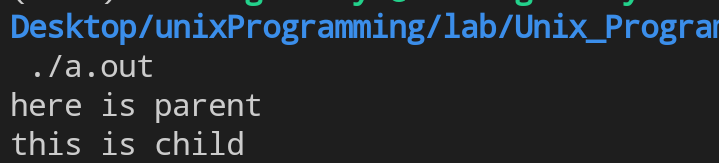
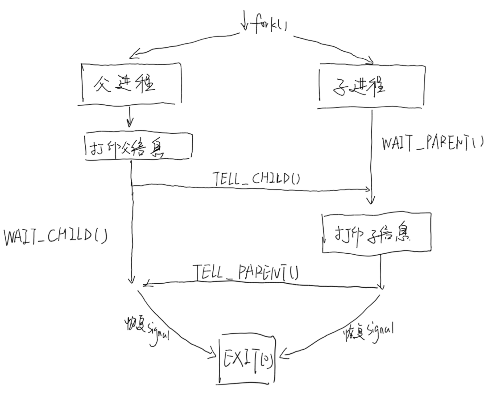

# 系统程序设计lab3
> 郭仲天 19307110250

## 实验目的
使用信号实现父,子进程之间的同步,了解`sigprocmask`,`sigsupend`等函数的使用

## 实验介绍
参考教材《UNIX环境高级编程》图10.24,实现`TELL_CHILD`,`WAIT_PARENT`,`TELL_PARENT`,`WAIT_CHILD`,`TELL_WAIT`函数,并用上述接口在父子进程之间实现同步，当父进程打印 "here is parent"后，子进程才打印"this is child"，注意:不能在子进程中使用`sleep()`接口

> 图10.24

```c
#include "apue.h"

static volatile sig_atomic_t sigflag; /* set nonzero by sig handler */
static sigset_t newmask, oldmask, zeromask;

static void
sig_usr(int signo)	/* one signal handler for SIGUSR1 and SIGUSR2 */
{
	sigflag = 1;
}

void
TELL_WAIT(void)
{
	if (signal(SIGUSR1, sig_usr) == SIG_ERR)
		err_sys("signal(SIGUSR1) error");
	if (signal(SIGUSR2, sig_usr) == SIG_ERR)
		err_sys("signal(SIGUSR2) error");
	sigemptyset(&zeromask);
	sigemptyset(&newmask);
	sigaddset(&newmask, SIGUSR1);
	sigaddset(&newmask, SIGUSR2);

	/* Block SIGUSR1 and SIGUSR2, and save current signal mask */
	if (sigprocmask(SIG_BLOCK, &newmask, &oldmask) < 0)
		err_sys("SIG_BLOCK error");
}

void
TELL_PARENT(pid_t pid)
{
	kill(pid, SIGUSR2);		/* tell parent we're done */
}

void
WAIT_PARENT(void)
{
	while (sigflag == 0)
		sigsuspend(&zeromask);	/* and wait for parent */
	sigflag = 0;

	/* Reset signal mask to original value */
	if (sigprocmask(SIG_SETMASK, &oldmask, NULL) < 0)
		err_sys("SIG_SETMASK error");
}

void
TELL_CHILD(pid_t pid)
{
	kill(pid, SIGUSR1);			/* tell child we're done */
}

void
WAIT_CHILD(void)
{
	while (sigflag == 0)
		sigsuspend(&zeromask);	/* and wait for child */
	sigflag = 0;

	/* Reset signal mask to original value */
	if (sigprocmask(SIG_SETMASK, &oldmask, NULL) < 0)
		err_sys("SIG_SETMASK error");
}

```

## 实验要求
1. 实验报告请提交源代码和实验报告Word文档(包括运行截图，实验思路和代码分析)，打包后以“学号_姓名.zip”命名，上传到本课程elearning平台
2. 正确实现TELL_CHILD(10分)，WAIT_PARENT(10分)，TELL_PARENT(10分)，WAIT_CHILD(10分)，TELL_WAIT(10分)，程序能正常运行且实现父子进程同步按要求输出(40分)，实验分析和总结(10分)

## 实验结果
### 如何运行
```bash
gcc signal_synchronize.c
./a.out
```
### 运行结果截图


## 实验思路与代码分析
### 实验思路
本次实验主要分为两个部分，第一个部分为**实现信号同步**，第二个部分为**实现父子进程利用信号同步**
#### 第一部分：实现信号同步
1. 参考图`10.24`，可知我们可以利用`SIGUSR1`和`SIGUSR2`来作为父子进程之间传递的信号。
2. 在`TELL_WAIT`函数中，我们对各个信号集做初始化，并且设置好`SIGUSR1`和`SIGUSR2`的信号处理函数。
3. 在`TELL_PARENT`和`TELL_CHILD`中，使用`KILL`接口来向各个进程发送对应的信号，也即`SIGUSR1`和`SIGUSR2`。
4. 在`WAIT_PARENT`和`WAIT_CHILD`中，使用`sigsuspend`来保证在接受所有信号之前，程序进入挂起状态，保证不使用sleep的情况下仍然存在父子进程的同步的先后顺序。
5. 使用一个全局变量`sigflag`来对当前状态做记录。

当按照上述的思路实现所有接口代码后，便实现了利用信号机制实现同步的接口实现，具体代码详见`signal_sysnchronize.h`。

#### 第二部分：实现父子进程利用信号同步
我们依然利用`fork`函数来创建父子进程，利用`pid`来区分父进程和子进程并执行对应的不同操作。

> main函数的具体内容如下：

```c
#include "signal_synchronize.h"

int main(){
    pid_t pid;
    // init the synchronize function
    TELL_WAIT();
    // fork the process
    pid = fork();
    if(pid < 0){
        printf("fork error!");
        exit(0);
    }
    // child process 
    else if(pid == 0){
        WAIT_PARENT();
        printf("this is child\n");
        TELL_PARENT(getppid());
    }
    // parent process
    else{
        printf("here is parent\n");
        TELL_CHILD(pid);
        WAIT_CHILD();

    }
    exit(0);
}
```

由代码可见，我们父子进程做了如下不同的操作：
##### 父进程
- 父进程率先打印`Here is parent`的信息，并且将父进程已经打印完成的信息通过信号调用`TELL_CHILD`发送给子进程。
- 发送完信号后，等待子进程发送子进程打印完成的信息通过信号发送给自己，也即调用`WAIT_CHILD`即可。

##### 子进程
- 子进程首先等待父进程打印完成，接收到父进程打印完成的信号后，开始打印自己打印完成的信息`This is child`。
- 打印完成后，通知父进程已经打印完成，也即调用`TELL_PARENT`。

