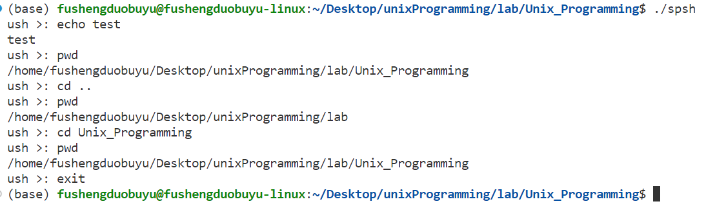

# 系统程序设计lab2
> 郭仲天 19307110250
## 实验介绍
参考提供的代码，为 UNIX 实现一个简单的用户 shell，提供命令执行、I/O 重定向、管道和环境处理功能。

## 实验要求
1. 支持基础指令或操作符（10分）：cd，echo，exit，pwd，这些指令应该作为shell的内部指令实现。
2. io重定向操作（10分）：>，<，>>，需要支持重定向到流和文件。
3. 处理环境变量（5分）：支持环境变量HOME和PATH，以及修改环境变量的操作符，包括=（环境变量赋值），set，unset，export。
4. 指令合法性检查（5分）：检查外部输入的指令是否合法。
管道操作符（10分）：支持｜管道操作符，注意执行每一个管道时应该等待前面的程序运行完成，除非是使用&操作符执行了后台程序，另外多个连接的管道也是合法的。
5. 实验报告文档（5分）：介绍本次实验中完成的功能，设计思路以及运行输出。
提示：execvp可以输入的命令，实现过程中注意捕获它的返回值以及打印可能的错误输出；具体代码任务可以参考实验代码注释中的“you must implement”部分。
---
## 实验过程
### 支持基础指令或操作符
要实现的指令有$cd，echo，exit，pwd$四个,用户输入往往是在换行符后,因此在$T_NL$后,调用`builtin`函数,用来处理内部指令.
在这里,将内部指令的处理逻辑直接放在了`builtin`函数中.
```c
static BOOLEAN builtin(int argc, char *argv[], int srcfd, int dstfd)
/* do built-in */
{
	// the built-in function is cd,echo,exit,pwd
	// exit
	if (argc > 0 && strcmp(argv[0], "exit") == 0){
		if(argc == 1)
			exit(0);
		else
			exit(atoi(argv[1]));
	}
	// echo
	if (argc > 0 && strcmp(argv[0], "echo") == 0){
		int i;
		for(i = 1; i < argc; i++){
			printf("%s ", argv[i]);
		}
		printf("\n");
		return TRUE;
	}
	// pwd
	if (argc > 0 && strcmp(argv[0], "pwd") == 0){
		char buf[100];
		getcwd(buf, 100);
		printf("%s\n", buf);
		return TRUE;
	}
	// cd
	if (argc > 0 && strcmp(argv[0], "cd") == 0){
		if(argc == 1){
			chdir(getenv("HOME"));
		}
		else{
			chdir(argv[1]);
		}
		return TRUE;
	}
	return FALSE;
}
```
### 指令执行图



